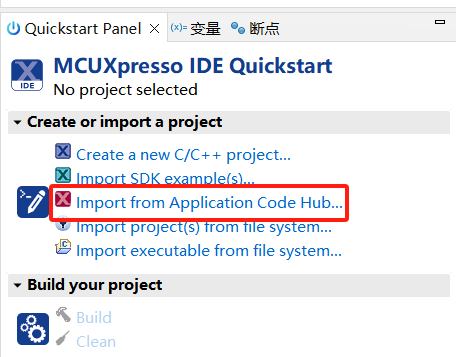
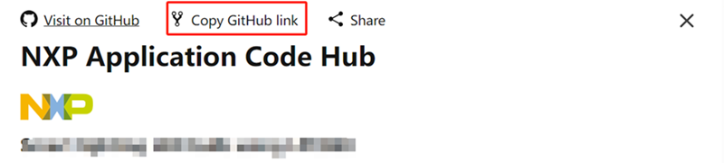
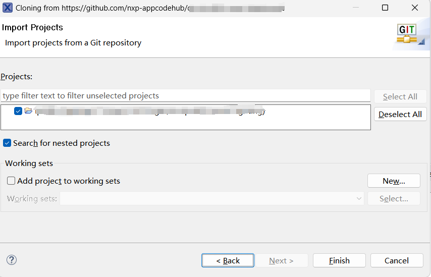

# NXP Application Code Hub

## WiFi_Cli_STA_MQTT
The WiFi_Cli_STA_MQTT demo application demonstrates Wi-Fi station's connection to an access point while facilitating asynchronous data exchange between the local device and a remote broker via the MQTT protocol.

#### Boards: MIMXRT1060-EVKC
#### Categories: RTOS, Networking, Wireless Connectivity, Security
#### Peripherals: Wi-Fi
#### Toolchains: MCUXpresso IDE

## Table of Contents
1. [Software](#step1)
2. [Hardware](#step2)
3. [Setup](#step3)
4. [FAQs](#step4) 
5. [Support](#step5)
6. [Release Notes](#step6)

## 1. Software
- [MCUXpresso 25.6 ](https://nxp.com/mcuxpresso)
- [SDK Version 25.12.000 for MIMXRT1060-EVKC.](https://mcuxpresso.nxp.com/en/select)

## 2. Hardware
- [MIMXRT1060-EVKC](https://www.nxp.com/part/MIMXRT1060-EVKC)
- [Murata 1XK M.2](https://docs.nxp.com/bundle/UM11441/page/topics/embedded_artists___murata__1xk_m_2_module.html)

## 3. Setup

### 3.1 Step 1
1. Open MCUXpresso IDE, in the Quick Start Panel, choose Import from Application Code Hub

2. Enter the demo name in the search bar.

3. Click Copy GitHub link, MCUXpresso IDE will automatically retrieve project attributes, then click Next>.

4. Select main branch and then click Next>, Select the MCUXpresso project, click Finish button to complete import.

### 3.2 Prepare demo
1. Connect a USB cable between the host PC and the OpenSDA USB port on the target board.

2. Open a serial terminal with the following settings:
	- 115200 baud rate
	- 8 data bits
	- No parity
	- One stop bit
	- No flow control

3. Import the existing project from MCUXpresso IDE.

4. Compile the project.

5. Download the built image to the board through debug probe USB port and run the example.

6. Expected startup output:

        ========================================
        wifi cli demo
        ========================================
        Initialize WLAN Driver
        ========================================
        Starting AP Connect DEMO
        [i] Initializing Wi-Fi connection... 
        STA MAC Address: 9C:50:D1:45:0F:5D 
        FW DOWNLOAD CMPLETE
        [i] Successfully initialized Wi-Fi module
        wlan_add_network
        Status is 0
        Connecting as client to ssid: Simple with password 12345678
    
7. Ensure Wi-Fi Access Point (or mobile hotspot) is active with the shown wi-fi credentials:

8. The EVK board will automatically scan and connect to the AP using the hardcoded credentials. Monitor the serial terminal to verify the Wi-Fi connection.

9. Confirm the following sequence appears in the console, indicating a successful connection:
 
    	[i] Connected to Wi-Fi
    	ssid: Simple
    	[!]passphrase: 12345678
    	Now join that network on your device and connect to this IP: 172.20.10.3
    	Resolving "broker.hivemq.com"...
    	Connecting to MQTT broker at 52.59.10.189 
    	mqtt_client_connect result - 0
        MQTT client "nxp_172171d7615548f0" connected.
    	Starting MQTT subscriptions...
    	Subscribing to the topic "lwip_topic/1" with QoS 0...
    	Subscribing to the topic "lwip_other/1" with QoS 1...
    	Subscribed to the topic "lwip_topic/1".
    	Going to publish to the topic "lwip_topic/100"...
    	Subscribed to the topic "lwip_other/1".
    	Published to the topic "lwip_topic/100".
    	Going to publish to the topic "lwip_topic/100"...
    	Published to the topic "lwip_topic/100".
    	Going to publish to the topic "lwip_topic/100"...

11. The board automatically subscribe for two specific topics: 1. The topic "lwip_topic/1" with QoS 0 and 2. The topic "lwip_other/1" with QoS 1.

12. Also board start to publish the messages on topic "lwip_topic/100" 

13. To verify the data exchange, use an MQTT client (like MQTT Explorer or HiveMQ) configured with:

Host: broker.hivemq.com

Port: 1883

Action 1 (Receive): Subscribe to "lwip_topic/100"  to see the board's messages.

Action 2 (Send): Publish a message to "lwip_topic/1" with QoS 0 and the topic "lwip_other/1" with QoS 1 and check the board's serial terminal to confirm receipt.

## 4. FAQs
*Include FAQs here if appropriate. If there are none, then remove this section.*

## 5. Support
*Provide URLs for help here.*

#### Project Metadata

<!----- Boards ----->

<!----- Categories ----->

<!----- Peripherals ----->

<!----- Toolchains ----->

Questions regarding the content/correctness of this example can be entered as Issues within this GitHub repository.

>**Warning**: For more general technical questions regarding NXP Microcontrollers and the difference in expected functionality, enter your questions on the [NXP Community Forum](https://community.nxp.com/)

## 6. Release Notes
| Version | Description / Update                           | Date                        |
|:-------:|------------------------------------------------|----------------------------:|
| 1.0     | Initial release on Application Code Hub        | June 25th 2026 |

<small> <b>Trademarks and Service Marks</b>: There are a number of proprietary logos, service marks, trademarks, slogans and product designations ("Marks") found on this Site. By making the Marks available on this Site, NXP is not granting you a license to use them in any fashion. Access to this Site does not confer upon you any license to the Marks under any of NXP or any third party's intellectual property rights. While NXP encourages others to link to our URL, no NXP trademark or service mark may be used as a hyperlink without NXP’s prior written permission. The following Marks are the property of NXP. This list is not comprehensive; the absence of a Mark from the list does not constitute a waiver of intellectual property rights established by NXP in a Mark. </small>   <small> NXP, the NXP logo, NXP SECURE CONNECTIONS FOR A SMARTER WORLD, Airfast, Altivec, ByLink, CodeWarrior, ColdFire, ColdFire+, CoolFlux, CoolFlux DSP, DESFire, EdgeLock, EdgeScale, EdgeVerse, elQ, Embrace, Freescale, GreenChip, HITAG, ICODE and I-CODE, Immersiv3D, I2C-bus logo , JCOP, Kinetis, Layerscape, MagniV, Mantis, MCCI, MIFARE, MIFARE Classic, MIFARE FleX, MIFARE4Mobile, MIFARE Plus, MIFARE Ultralight, MiGLO, MOBILEGT, NTAG, PEG, Plus X, POR, PowerQUICC, Processor Expert, QorIQ, QorIQ Qonverge, RoadLink wordmark and logo, SafeAssure, SafeAssure logo , SmartLX, SmartMX, StarCore, Symphony, Tower, TriMedia, Trimension, UCODE, VortiQa, Vybrid are trademarks of NXP B.V. All other product or service names are the property of their respective owners. © 2021 NXP B.V. </small>
